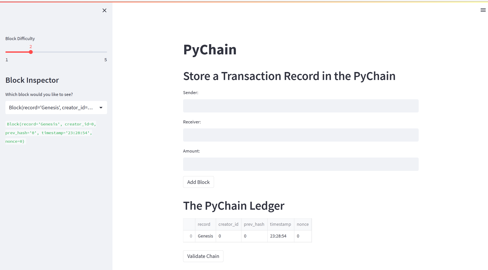
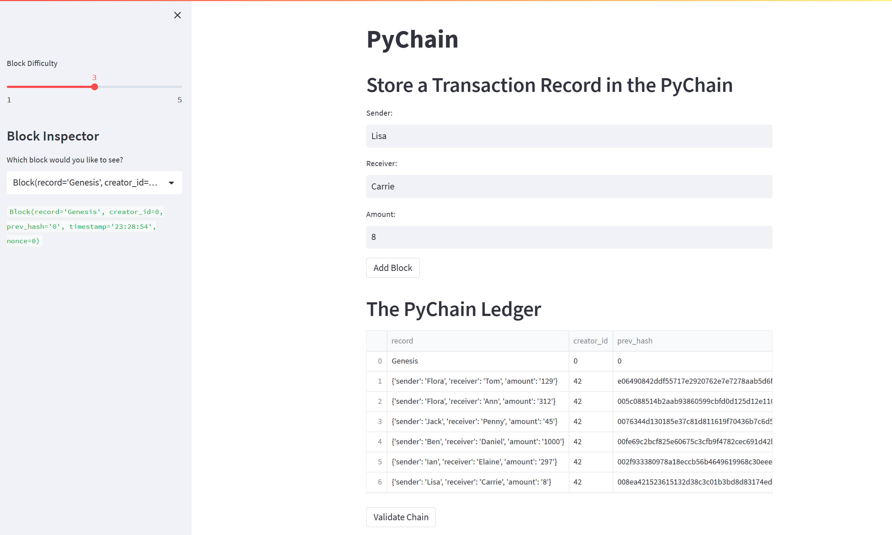
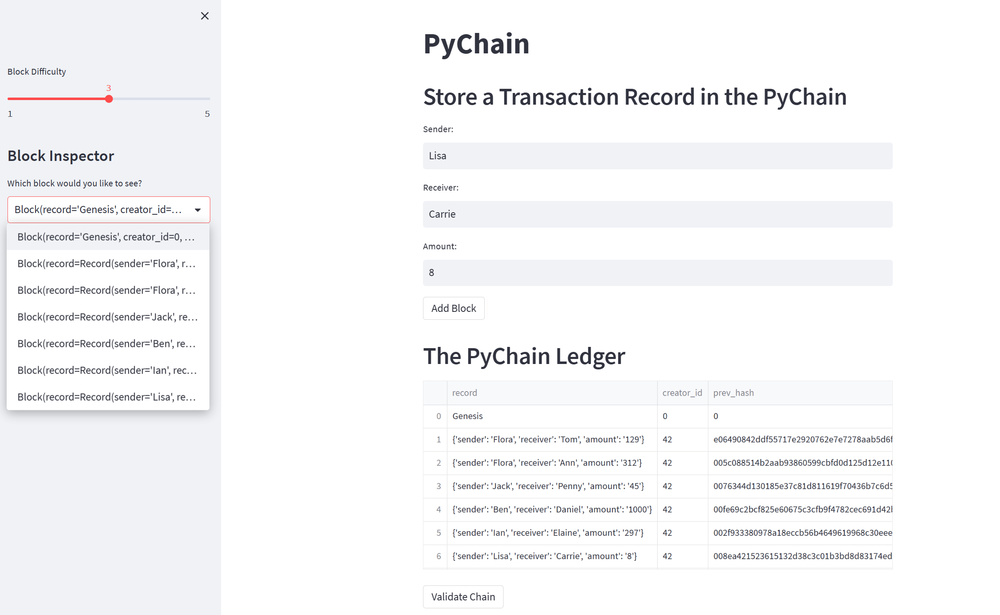
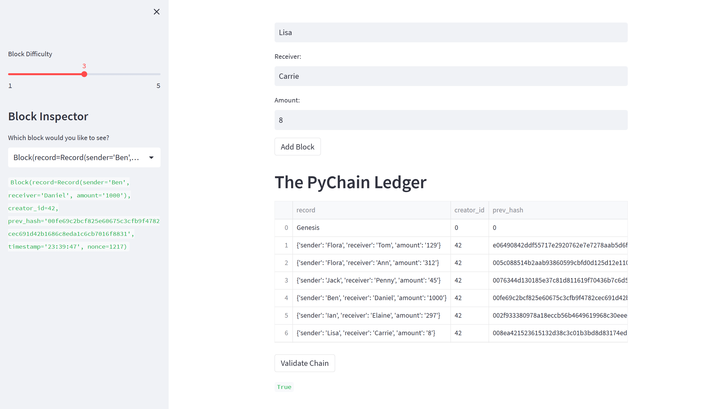

# PyChain Ledger

# Assignment Description
You’re a fintech engineer who’s working at one of the five largest banks in the world. You were recently promoted to act as the lead developer on their decentralized finance team. Your task is to build a blockchain-based ledger system, complete with a user-friendly web interface. This ledger should allow partner banks to conduct financial transactions (that is, to transfer money between senders and receivers) and to verify the integrity of the data in the ledger.

# App Execution Results
## Initial screenshot after running the app

## Adding multiple blocks 

## Selecting a specific block and verifying the block content and hash on the sidebar

## Click 'Validate Chain' button and check the validation result

---
## Summary
- The blockchain ledger starts with one record only and takes in the input information from the user including sender, receiver and amount. Once the user click 'Add Block' button, a new block will be added to the chain and the PyChain Ledger info will be updated accordingly.
- On the sidebar, you can adjust the difficulty level for the PoW calculation from 1 to 5, default is 2.
- On the sidebar, you can choose from the chain a specific block and the info of this block will be displayed below.

---

18-01-2023